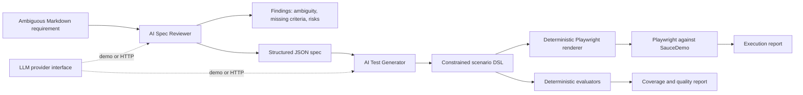

# AI Spec-Driven QA

A portfolio-sized experiment in **AI-assisted QA**, using [SauceDemo](https://www.saucedemo.com/) as the application under test. It reviews ambiguous requirements, proposes explicit acceptance criteria, generates a constrained test-scenario model, renders executable Playwright tests, and scores the result with deterministic evaluators.

This is deliberately a lab, not a production framework. Its purpose is to make design choices, risks, and evaluation results easy to discuss in an interview.

## Why this project exists

Most “AI test generator” demos stop after producing plausible-looking code. This project asks the harder questions:

- Did the generated tests cover the requirements?
- Can every scenario be traced to an acceptance criterion?
- Did the model invent behavior the product does not support?
- Can the output be rendered and executed?
- Does generation quality change across repeated runs?

The model never writes arbitrary executable code. It returns JSON in a small action language; a deterministic renderer converts allow-listed actions into Playwright. Unsupported actions are rejected and scored before execution.

## Architecture



### Trust boundary

| Stage | Model-assisted? | Guardrail |
|---|---:|---|
| Find specification gaps | Yes | Review schema and consistency checks |
| Propose acceptance criteria | Yes | Unique IDs and required criteria |
| Generate scenarios | Yes | JSON action DSL only |
| Create Playwright source | No | Deterministic allow-listed renderer |
| Coverage, relevance, unsupported behavior | No | Deterministic trace/action checks |
| Executability before browser run | No | Every action must render |
| Semantic quality judge | Optional, not enabled in V1 | Would be reported separately as `evaluator: llm` |

## Quick start

Requirements: Node.js 20+ (the project compiles first and runs on plain Node; no runtime TypeScript loader is required).

```bash
npm install
npx playwright install chromium
npm run demo
npm run qa -- run
```

`npm run demo` needs no API key. It uses the seeded demo provider, writes reviews/specs/scenarios/evaluations to `artifacts/`, and writes executable specs to `generated/`.

Run the deterministic unit checks:

```bash
npm run check
npm test
```

## CLI

```bash
# Full offline pipeline for both requirements
npm run qa -- demo

# Generate, evaluate, and execute the Playwright suite
npm run qa -- run

# One requirement and a chosen seed
npm run qa -- demo --requirement login --seed 2

# Five generations; report mean score and full-coverage pass rate
npm run qa -- repeat --runs 5

# Up to 50 runs for one requirement
npm run qa -- repeat --requirement cart-checkout --runs 20

# Show help
npm run qa -- help
```

Supported options:

| Option | Values | Default |
|---|---|---|
| `--requirement` | `login`, `cart-checkout`, `all` | `all` |
| `--provider` | `demo`, `http` | `demo` |
| `--seed` | integer | `0` |
| `--runs` | 2–50 | `5` |

## Inputs and outputs

The two source requirements in [`requirements/`](requirements/) deliberately leave observable behavior unresolved. The reviewer records four things rather than silently guessing:

1. ambiguities;
2. missing acceptance criteria;
3. risks;
4. explicit assumptions and out-of-scope behavior in a proposed JSON spec.

Example console output:

```text
✓ login: 4 findings, 4 scenarios, evaluation 100%
✓ cart-checkout: 4 findings, 4 scenarios, evaluation 100%
Generated Playwright tests and reports under generated/ and artifacts/.
```

Example repeated-run summary:

```text
requirementId   runs  meanScore  fullCoveragePassRate  scenarioCounts
login           5     0.975      0.6                   4,3,4,4,3
cart-checkout   5     0.975      0.6                   4,3,4,4,3
```

The committed [`examples/sample-evaluation.json`](examples/sample-evaluation.json) shows the report shape. Timestamps and generated artifacts are ignored by Git to keep commits clean.

## Evaluators

All V1 scores are labeled `deterministic`.

| Metric | What it measures | Important caveat |
|---|---|---|
| Requirement coverage | Acceptance-criterion IDs traced by at least one scenario | Traceability can be claimed incorrectly; semantic validation is future work |
| Relevance | Scenarios reference only known criterion IDs | It does not judge whether prose truly matches the criterion |
| Unsupported behavior | Actions are allow-listed and prose avoids known unsupported concepts | The unsupported-term catalog is intentionally small |
| Executability | Each scenario can be rendered by the trusted renderer | Browser results are a separate, stronger signal |

`overallScore` is the unweighted mean of the four metrics. The repeated-run report adds:

- **mean score** across generations;
- **full-coverage pass rate**, the proportion of runs with 100% criterion coverage;
- scenario-count variation, a quick signal that outputs differed.

The seeded provider intentionally omits a lower-priority scenario on some seeds. This is controlled simulation, not evidence about any real model. With an actual provider, repeated runs measure that provider/configuration instead.

## Using an actual LLM

The `LlmProvider` interface keeps review and generation independent of a vendor. V1 includes a small OpenAI-compatible chat-completions HTTP adapter:

```bash
copy .env.example .env
# Load the variables in your shell, then:
npm run qa -- demo --provider http
```

Required environment variables are `LLM_BASE_URL`, `LLM_API_KEY`, and `LLM_MODEL`. Secrets are never committed. Provider output is parsed as JSON and then checked, but the HTTP adapter is intentionally minimal; production code should use strict JSON Schema/Structured Outputs, retries, rate-limit handling, redaction, and fuller runtime validation.

## Interview demo walkthrough (about 6 minutes)

1. **Show the ambiguous input (45 sec).** Open `requirements/cart-checkout.md`. Point out that “accurate” and “clear confirmation” are not testable.
2. **Run the pipeline (45 sec).** Use `npm run qa -- demo --requirement cart-checkout`. Open the review and structured spec under `artifacts/`.
3. **Explain the boundary (60 sec).** Open the scenario JSON, then the generated `.spec.ts`. The model proposes intent; the renderer owns executable code.
4. **Show evaluation (60 sec).** Explain deterministic coverage, relevance, unsupported-behavior, and renderability scores. Mention the limitations honestly.
5. **Run the browser tests (90 sec).** Use `npm run qa -- run`. If the public demo is unavailable, show the HTML report from a prior run and explain external-test dependency risk.
6. **Demonstrate non-determinism (60 sec).** Use `npm run qa -- repeat --runs 5`; discuss mean score and full-coverage pass rate instead of trusting one lucky generation.
7. **Close with next steps (30 sec).** Stronger schema validation, semantic judge calibration against human labels, and flake/history analysis—not more features for their own sake.

## Repository map

```text
requirements/           intentionally ambiguous source requirements
src/llm/                provider contract plus demo and HTTP adapters
src/spec-reviewer.ts    requirement-to-structured-spec stage
src/test-generator.ts   structured-spec-to-scenario stage
src/renderer.ts         trusted scenario-to-Playwright renderer
src/evaluator.ts        deterministic quality metrics
generated/              generated Playwright tests (ignored)
artifacts/              reviews, specs, scenarios, metrics (ignored)
tests/                  evaluator and renderer unit tests
.github/workflows/      reproducible CI and report upload
```

## Limitations and honest claims

- SauceDemo is a public training site; availability and UI changes are outside this repository's control.
- The capability catalog covers only login, one-product cart management, and the basic checkout flow.
- ID-based coverage is useful but not semantic proof. A future LLM judge must be calibrated against human labels and reported separately.
- The demo provider is fixture-based and only simulates bounded variation. It exists so every reviewer can reproduce the pipeline without credentials.
- The HTTP adapter has basic JSON parsing, not comprehensive schema validation or resilience.
- No claim is made that the generated suite is complete, production-safe, or a substitute for QA judgment.
- Test credentials are SauceDemo's public training credentials; real secrets should come from a secret manager.

## CI

GitHub Actions performs type checking, unit tests, offline generation, Chromium installation, and live SauceDemo execution. Reports upload even on failure. Add a repository-specific build badge after creating the remote.

## License

MIT. SauceDemo is an external application used only as a public test target; this project is not affiliated with it.
